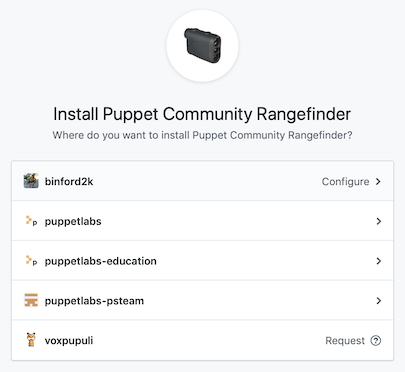

# Rangefinder GitHub integration

Rangefinder is a tool that helps predict the downstream impact of breaking
file changes. This GitHub integration allows us to tie it to pull requests
and provide impact prediction reports as comments when a PR is filed.

It's still fairly young in its development, so please don't hesitate to
file issues either here or on the 
[Rangefinder tool](https://github.com/puppetlabs/puppet-community-rangefinder) itself.

## Installation

1. Visit its [GitHub app page](https://github.com/apps/puppet-community-rangefinder).
2. Click **Install App** in the sidebar.
3. Select your name or an organization you belong to.
4. Then select the repositories you'd like to enable the app on.

## Limitations

This is super early in development and has not yet been battle tested.

## Disclaimer

I take no liability for the use of this tool.

Contact
-------

binford2k@gmail.com

